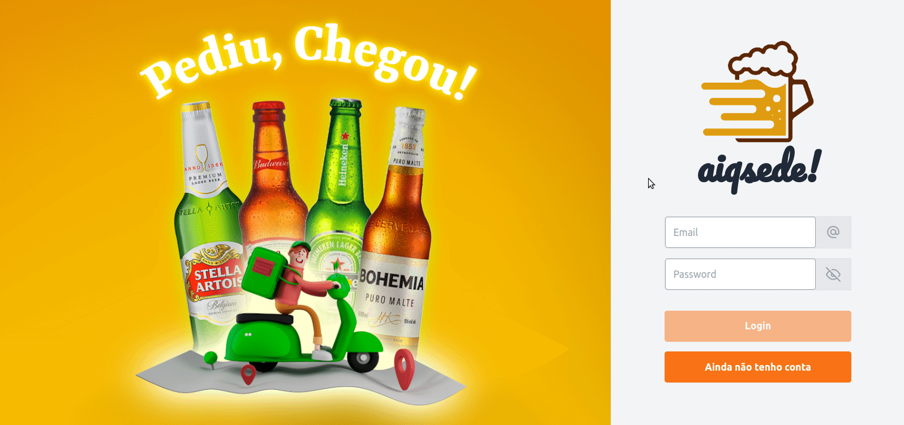

# About the project / *Sobre o projeto*

This is an On demand delivery app as the final full stack project. The app covers all features such as login with token, user registration, products list, order products, checkout, order management and user management. App developed in front end and back end made with the most modern technologies such as React, Node, Sequelize, Docker, etc. We were on a group of 5 and finished in a 2 weeks sprint in a agile environment with daily meetings and kanban board to organize the work and to minimize code conflicts.

---

*Este é um aplicativo de entrega sob demanda como o projeto final Full Stack. O aplicativo abrange todos os recursos, como login com token, cadastro de usuários, lista de produtos, pedidos de produtos, checkout, gerenciamento de pedidos e gerenciamento de usuários. App desenvolvido em front end e back end feito com as mais modernas tecnologias como React, Node, Sequelize, Docker, etc. Estávamos em um grupo de 5 e finalizamos em um sprint de 2 semanas em ambiente ágil com reuniões diárias e quadro kanban para organizar o trabalho e minimizar conflitos de código.*

---
# Skills / *Habilidades*

  - Full Stack development / *Desenvolvimento Full Stack*
  - React / Redux
  - NodeJS
  - Sequelize
  - REST Api endpoints
  - Bootstrap / Tailwind
  - React-icons
  - Token and user validation / *Token e validação de usuário*
  - LocalStorage manipulation / *Manipulação no LocalStorage*
  - MySQL
  - Docker
  - Conventional Commits / *Commit Converncionais*
  - Asynchronous functions / *Funções assíncronas*

---
# Layout

---
# Deployment / *Implantação*

See it in action/ **Veja em ação**: [https://github.com/kelsonbatista/project-delivery-app/](https://kelsonbatista.github.io/project-delivery-app/)

Commands:

- git clone git@github.com:kelsonbatista/project-delivery-app.git
- Run npm install in / , and /front-end and /back-end
- Run database inside Docker: in / run "docker compose:up:dev
- In /back-end run "npm run dev"
- In /back-end run "npm run db:reset" to seed basic information into db
- In /front-end run "npm start"
- Access http://localhost:3000, register a new user, ready to go.
